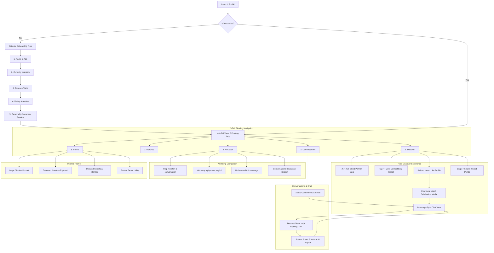

# Application Flow & Navigation - SoulAI

```mermaid
flowchart TD
    A[Launch SoulAI] --> B{isOnboarded?}
    B -- No --> C[Editorial Onboarding Flow]
    C --> C1[1. Name & Age]
    C1 --> C2[2. Curiosity Interests]
    C2 --> C3[3. Essence Traits]
    C3 --> C4[4. Dating Intention]
    C4 --> C5[5. Personality Summary Preview]
    C5 --> D[MainTabView: 5 Floating Tabs]
    B -- Yes --> D

    subgraph "5-Tab Floating Navigation"
        D --> T1[1. Discover]
        D --> T2[2. Matches]
        D --> T3[3. Conversations]
        D --> T4[4. AI Coach]
        D --> T5[5. Profile]
    end

    subgraph "Hero Discover Experience"
        T1 --> T1A[75% Full Bleed Portrait Card]
        T1 --> T1B[Tap ✦: View Compatibility Sheet]
        T1 --> T1C[Swipe / Heart: Like Profile]
        T1 --> T1D[Swipe / Xmark: Reject Profile]
        T1C --> M1[Emotional Match Celebration Modal]
        M1 --> T3A[Direct Chat with Match]
    end

    subgraph "Conversations & Chat"
        T3 --> T3List[Active Connections & Chats]
        T3List --> T3A[iMessage-Style Chat View]
        T3A --> T3B[Discreet 'Need help replying?' Pill]
        T3B --> T3C[Bottom Sheet: 3 Natural AI Replies]
        T3C --> T3A
    end

    subgraph "AI Dating Companion"
        T4 --> T4A["Help me start a conversation"]
        T4 --> T4B["Make my reply more playful"]
        T4 --> T4C["Understand this message"]
        T4 --> T4D[Conversational Guidance Stream]
    end

    subgraph "Minimal Profile"
        T5 --> T5A[Large Circular Portrait]
        T5 --> T5B[Essence: 'Creative Explorer']
        T5 --> T5C[3 Clean Interests & Intention]
        T5 --> T5D[Restart Demo Utility]
    end
```
