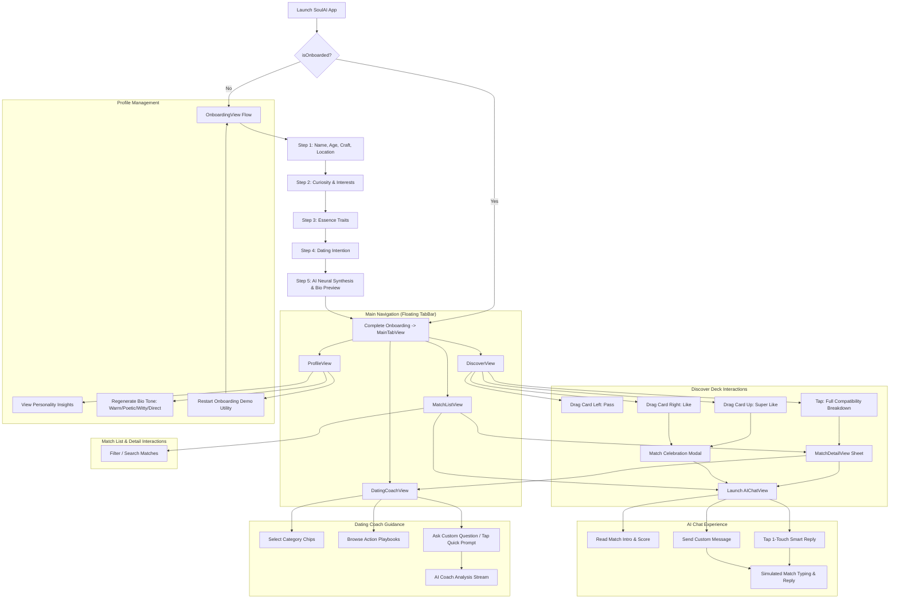

# Application Navigation & User Flow - SoulAI

```mermaid
flowchart TD
    A[Launch SoulAI App] --> B{isOnboarded?}
    B -- No --> C[OnboardingView Flow]
    C --> C1[Step 1: Name, Age, Craft, Location]
    C1 --> C2[Step 2: Curiosity & Interests]
    C2 --> C3[Step 3: Essence Traits]
    C3 --> C4[Step 4: Dating Intention]
    C4 --> C5[Step 5: AI Neural Synthesis & Bio Preview]
    C5 --> D[Complete Onboarding -> MainTabView]
    B -- Yes --> D

    subgraph "Main Navigation (Floating TabBar)"
        D --> E[DiscoverView]
        D --> F[MatchListView]
        D --> G[DatingCoachView]
        D --> H[ProfileView]
    end

    subgraph "Discover Deck Interactions"
        E --> E1[Drag Card Left: Pass]
        E --> E2[Drag Card Right: Like]
        E --> E3[Drag Card Up: Super Like]
        E2 --> E4[Match Celebration Modal]
        E3 --> E4
        E4 --> I[Launch AIChatView]
        E --> E5[Tap: Full Compatibility Breakdown]
        E5 --> J[MatchDetailView Sheet]
    end

    subgraph "Match List & Detail Interactions"
        F --> F1[Filter / Search Matches]
        F --> J
        F --> I
        J --> I
        J --> G
    end

    subgraph "AI Chat Experience"
        I --> I1[Read Match Intro & Score]
        I --> I2[Send Custom Message]
        I --> I3[Tap 1-Touch Smart Reply]
        I2 --> I4[Simulated Match Typing & Reply]
        I3 --> I4
    end

    subgraph "Dating Coach Guidance"
        G --> G1[Select Category Chips]
        G --> G2[Browse Action Playbooks]
        G --> G3[Ask Custom Question / Tap Quick Prompt]
        G3 --> G4[AI Coach Analysis Stream]
    end

    subgraph "Profile Management"
        H --> H1[View Personality Insights]
        H --> H2[Regenerate Bio Tone: Warm/Poetic/Witty/Direct]
        H --> H3[Restart Onboarding Demo Utility]
        H3 --> C
    end
```
